<p align="center">
  
</p>

<p align="center">
  <a href="mailto:alisakib543@gmail.com"></a>
  <a href="https://linkedin.com/in/saqib-ali-developer"></a>
  
  
</p>

<br>

## `>` whoami

I build production web applications in **Next.js, React, TypeScript and Node** — and I deploy and maintain them myself on Linux servers. That second part is where most projects actually break.

Nearly three years shipping to production, including two years of remote asynchronous work with US-based clients. Two complete systems designed and built independently, covered by 500+ automated tests.

Currently at **WB Communications**, maintaining an OSHA-authorized safety training platform in live production.

```ts
const saqib = {
  role:     "Full-Stack Developer",
  building: ["Next.js", "React", "TypeScript", "Node", "Express"],
  storing:  ["MongoDB", "MySQL", "SQLite", "Redis"],
  shipping: ["AWS EC2", "Ubuntu", "Nginx", "Caddy", "PM2"],
  testing:  ["Jest", "Supertest", "xUnit", "Playwright"],
  openTo:   "remote work across EU hours and US-East afternoons",
} as const;
```

<br>


<br>

## `>` selected work

<table>
<tr>
<td width="50%" valign="top">

### Nawab Pakwan
**Real-time restaurant ordering platform**

Four connected surfaces on one system: customer storefront, live kitchen console, rider app, and owner analytics dashboard.

Orders travel over Socket.IO with a 20-second polling fallback, plus Web Push so alerts reach staff on locked devices. Nothing about money is trusted from the client — pricing is re-validated server-side, and a payment state machine keeps unpaid orders out of the kitchen queue. Auth is JWT in httpOnly cookies with token versioning across three roles, so a compromised session dies on every device at once.

**194 backend tests.** Provisioned and deployed on AWS EC2 by me — PM2 zero-downtime reloads, Caddy reverse proxy, scripted deploys.

`Next.js 16` `React 19` `TypeScript` `Node` `MongoDB` `Socket.IO` `AWS`

</td>
<td width="50%" valign="top">

### Kismo Pharmacy
**Offline-first point-of-sale**

A fully offline Windows POS for independent pharmacies, shipped as a single self-contained executable. No runtime install, no database setup, no internet.

Currency is modelled as integer paisa so till reconciliation never drifts. Maximum retail price is enforced as a database constraint rather than app validation, so it can't be bypassed. The credit ledger derives balances from immutable history instead of an editable column. Receipts print directly over ESC/POS, and the sale commits *before* printing — so a paper jam can never lose a transaction.

**~335 tests** across a layered architecture isolating domain logic from database and hardware.

`C#` `.NET 10` `WPF` `SQLite` `Dapper` `xUnit`

</td>
</tr>
</table>

<table>
<tr>
<td width="50%" valign="top">

### [OSHA Training School](https://store.oshatrainingschool.com) 🇺🇸
**LMS e-commerce platform**

Storefront for an OSHA-authorized US training provider selling ~60 online safety courses in English and Spanish.

The core of the build was **Edwiser Bridge**, connecting WooCommerce to a Moodle LMS so a purchase automatically provisions the learner's enrolment — no manual step between payment and access.

`WordPress` `WooCommerce` `Moodle` `PHP`

</td>
<td width="50%" valign="top">

### [Al Rehman Security](https://walisecurity.vercel.app)
**Multi-page marketing site**

Nine server-rendered pages for a government-licensed security company, structured around six service verticals so visitors land on their own use case.

Animated statistics, validated enquiry form, maps integration, and full Open Graph and local SEO metadata.

`Next.js` `TypeScript` `Tailwind` `SEO`

</td>
</tr>
</table>

<br>

## `>` also shipped

| Project | What it is | Stack |
|---|---|---|
| **[WB Communications](https://wb-communications.co)** | Corporate site for a software agency, SSR with an animated product dashboard | `Next.js 16` |
| **[AR Trakker](https://www.artrakker.com)** | Single-page lead-gen site for a GPS tracking company, WhatsApp-first conversion | `HTML` `JS` |
| **[Crazzy4Shoes](https://crazzy4shoes.com)** | Full WooCommerce storefront — hosting, domain, theme and go-live all mine | `WordPress` |
| **BeatBuy** | Event ticketing front end with Stripe and interactive seat-map selection | `React` `TypeScript` |
| **Web scraper** | Playwright extraction tool that cut manual data collection effort ~90% | `Playwright` `TS` |
| **Rentifi** | MERN car rental app — backend: data modelling, REST APIs, auth, booking logic | `Node` `MongoDB` |

<br>

## `>` stack

<p>

</p>
<p>

</p>
<p>

</p>
<p>

</p>

<br>

## `>` the numbers

<p align="center">
  
  
</p>

<p align="center">
  
</p>

<p align="center">
  
</p>

<p align="center">
  
</p>

<br>

## `>` why I write tests

Because I've been on call for my own production systems.

I'd rather catch a defect in CI than at 11pm with a kitchen full of orders and a phone that won't stop ringing. Tests in my projects aren't there for a coverage badge — each one is a regression lock against a specific defect that actually happened.

<br>

---

<p align="center">
  <sub><b>Open to remote work across EU hours and US-East afternoons.</b></sub><br>
  <sub>Karachi, Pakistan &nbsp;·&nbsp; UTC+5 &nbsp;·&nbsp; alisakib543@gmail.com</sub>
</p>
