  

  
  
  
  

 

 

## `>` whoami

I build production web applications in **Next.js, React, TypeScript and Node** — and I deploy and maintain them myself on Linux servers. That second part is where most projects actually break.

Nearly three years shipping to production, including two years of remote asynchronous work with US-based clients. Two complete systems designed and built independently, covered by 500+ automated tests.

Currently at **WB Communications**, maintaining an OSHA-authorized safety training platform in live production.

<b>&nbsp;How I actually work</b>

 

**I finish things.** A repo that runs on localhost isn't a project. Provisioning the box, configuring the reverse proxy, wiring up HTTPS, scripting the deploy, and being the one who gets called when it breaks — that's the job I sign up for.

**I don't trust the client.** Prices get re-validated server-side. State machines enforce what the UI merely suggests. Constraints live in the database, not in a validation function someone can bypass.

**I write tests as regression locks.** Not for a coverage badge. Each test in my projects exists because something specific broke, and I decided it would never break silently again.

**I work async.** Two years across a 10-hour gap with US clients. Written updates, clear handoffs, no waiting on me to be awake.

 

## `>` selected work

<table>
<tr>
<td width="50%"></td>
<td width="50%"></td>
</tr>
<tr>
<td width="50%"></td>
<td width="50%"></td>
</tr>
</table>

<b>&nbsp;The decisions behind these, in more detail</b>

 

**Nawab Pakwan — why a polling fallback?**  
Sockets drop. On restaurant wifi they drop constantly. A kitchen that silently stops receiving orders is worse than no system at all, so a 20-second poll runs underneath the socket as a floor. Web Push covers the case where the tablet is locked.

**Nawab Pakwan — why token versioning?**  
Stateless JWTs can't be revoked. Add a version number to the user record, embed it in the token, compare on every request — now bumping one integer kills every session on every device instantly. Costs one field, buys real security.

**Kismo — why integer paisa?**  
Floating-point arithmetic drifts. On a till that reconciles daily, drift becomes a variance nobody can explain and a pharmacist who stops trusting the software. Integers can't drift.

**Kismo — why commit before printing?**  
Printers jam, run out of paper, and lose USB connection. If the sale commits after printing, a jam loses the transaction and the money. Commit first, print second, reprint on demand.

**OSHA — why Edwiser Bridge?**  
WooCommerce handles money well. Moodle handles learning well. Neither handles the other. The bridge means a payment provisions an enrolment automatically instead of someone manually adding students to courses every day.

 

## `>` also shipped

<table>
<tr>
<td width="33%" valign="top">

**[WB Communications](https://wb-communications.co)**

Corporate site for a software agency. SSR with an animated product dashboard as the hero.

`Next.js 16` `SSR`

</td>
<td width="33%" valign="top">

**[AR Trakker](https://www.artrakker.com)**

Single-page lead-gen site for a GPS tracking company. WhatsApp-first conversion, no checkout.

`HTML` `JS` `SEO`

</td>
<td width="33%" valign="top">

**[Crazzy4Shoes](https://crazzy4shoes.com)**

Full WooCommerce storefront. Hosting, domain, theme and go-live all mine.

`WordPress` `WooCommerce`

</td>
</tr>
<tr>
<td width="33%" valign="top">

**BeatBuy**

Event ticketing front end. Stripe payments and interactive seat-map selection.

`React` `TypeScript` `Stripe`

</td>
<td width="33%" valign="top">

**Web scraper**

Playwright extraction tool that cut manual data collection effort by ~90%.

`Playwright` `TypeScript`

</td>
<td width="33%" valign="top">

**Rentifi**

MERN car rental app. Backend: data modelling, REST APIs, auth, booking logic.

`Node` `Express` `MongoDB`

</td>
</tr>
</table>

 

## `>` stack

 

## `>` the numbers

  
  

 

## `>` why I write tests

Because I've been on call for my own production systems.

I'd rather catch a defect in CI than at 11pm with a kitchen full of orders and a phone that won't stop ringing. The 500+ tests across my projects aren't there for a coverage number — each one is a lock against a specific defect that actually happened once, and won't get the chance again.

 

---

  

  <b>alisakib543@gmail.com</b>&nbsp;&nbsp;·&nbsp;&nbsp;Karachi, Pakistan&nbsp;&nbsp;·&nbsp;&nbsp;UTC+5

